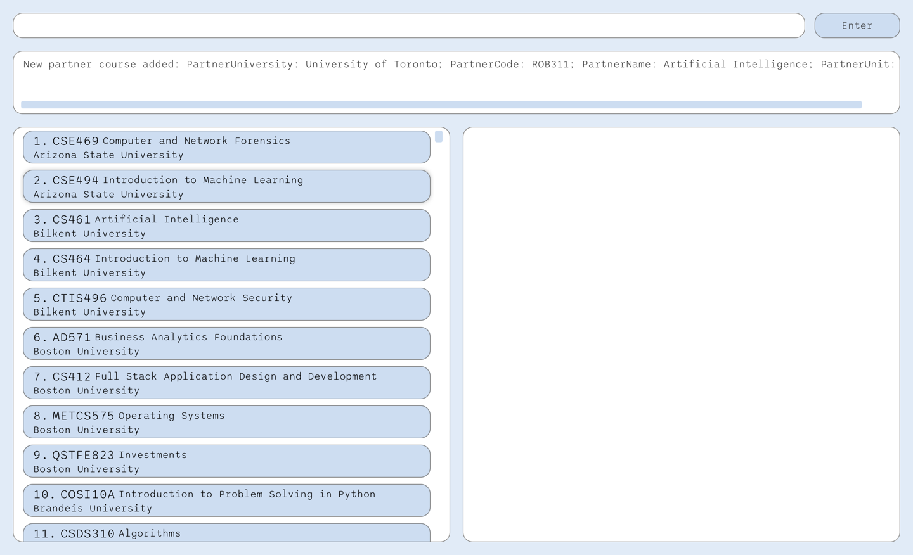
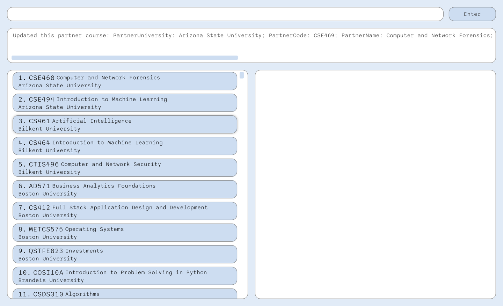
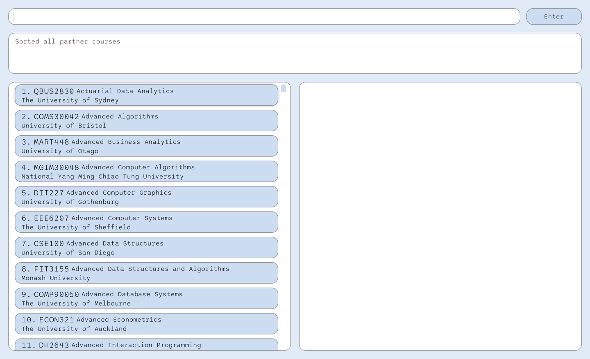
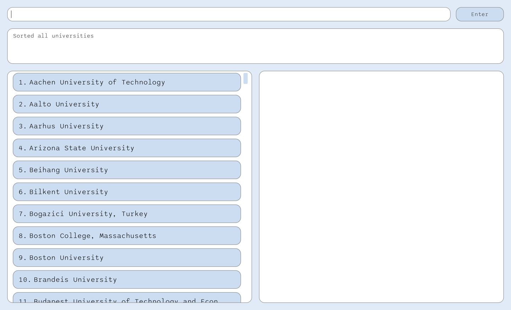
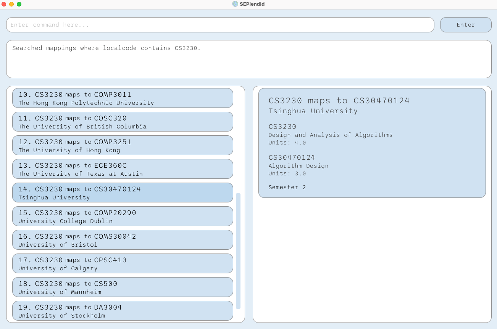
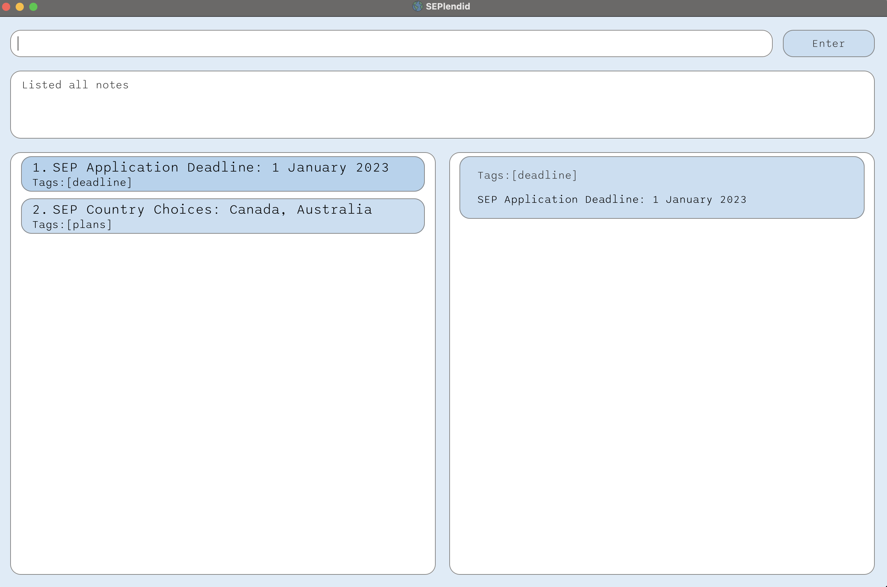
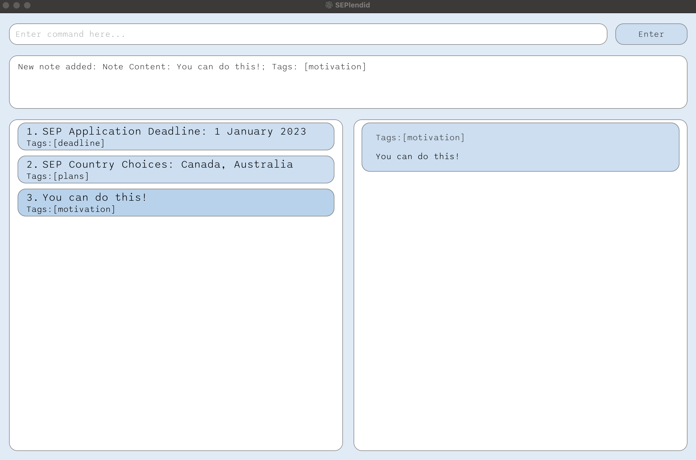
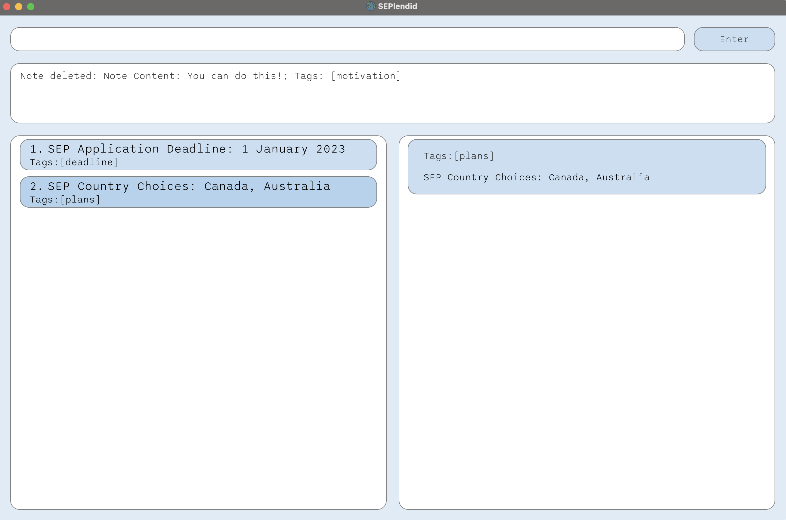
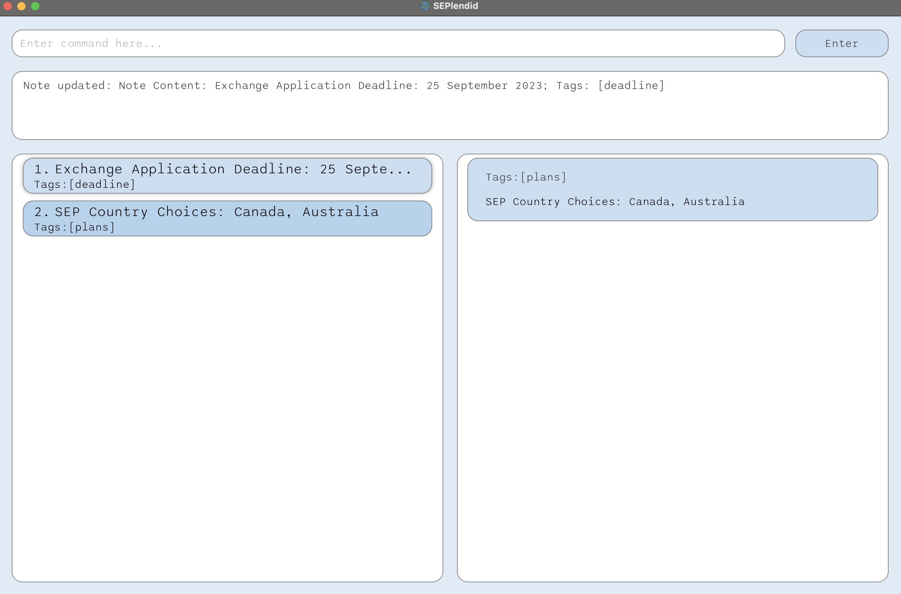

<bottom-head>
    <link rel="stylesheet" href="stylesheets/userguide.css">
</bottom-head>

# SEPlendid User Guide
 

## Table of Contents

--------------------------------------------------------------------------------------------------------------------

1. [About SEPlendid](#1-about-seplendid)
2. [Quick start](#2-quick-start)
3. [A Short Tutorial](#3-a-short-tutorial)
   - 3.1. [Graphical User Interface (GUI)](#3-1-graphical-user-interface-gui)
   - 3.2. [Command Format](#3-2-command-format)
   - 3.3. [Execute your first command](#3-3-execute-your-first-command)
4. [Commands](#4-commands)
   - 4.1. [Commands for localcourse](#4-1-commands-for-localcourse)
     - 4.1.1. [List all localcourses: `localcourse list`](#4-1-1-list-all-localcourses-localcourse-list)
     - 4.1.2. [Add a local course: `localcourse add`](#4-1-2-add-a-local-course-localcourse-add)
     - 4.1.3. [Delete a local course: `localcourse delete`](#4-1-3-delete-a-local-course-localcourse-delete)
     - 4.1.4. [Search a local course by attributes: `localcourse search`](#4-1-4-search-a-local-course-by-attributes-localcourse-search)
     - 4.1.5. [Sort a local course by attributes: `localcourse sort`](#4-1-5-sort-a-local-course-by-attributes-localcourse-sort)
   - 4.2. [Commands for partnercourse](#4-2-commands-for-partnercourse)
     - 4.2.1. [List all partnercourses: `partnercourse list`](#4-2-1-list-all-partnercourses-partnercourse-list)
     - 4.2.2. [Add a partnercourse: `partnercourse add`](#4-2-2-add-a-partnercourse-partnercourse-add)
     - 4.2.3. [Delete a partnercourse: `partnercourse delete`](#4-2-3-delete-a-partnercourse-partnercourse-delete)
     - 4.2.4. [Search a partnercourse by attributes: `partnercourse search`](#4-2-4-search-a-partnercourse-by-attributes-partnercourse-search)
     - 4.2.5. [Sort a partnercourse by attributes: `partnercourse sort`](#4-2-5-sort-a-partnercourse-by-attributes-partnercourse-sort)
   - 4.3. [Commands for universities](#4-3-commands-for-universities)
     - 4.3.1. [List all universities: `university list`](#4-3-1-list-all-universities-university-list)
     - 4.3.2. [Search a university by attributes: `university search`](#4-3-2-search-a-university-by-attributes-university-search)
     - 4.3.3. [Sort a university by attributes: `university sort`](#4-3-3-sort-a-university-by-attributes-university-sort)
   - 4.4. [Commands for mappings](#4-4-commands-for-mappings)
     - 4.4.1. [List all mappings: `mapping list`](#4-4-1-list-all-mappings-mapping-list)
     - 4.4.2. [Add a mapping: `mapping add`](#4-4-2-add-a-mapping-mapping-add)
     - 4.4.3. [Delete a mapping: `mapping delete`](#4-4-3-delete-a-mapping-mapping-delete)
     - 4.4.4. [Search a mapping by attributes: `mapping search`](#4-4-4-search-a-mapping-by-attributes-mapping-search)
     - 4.4.5. [Sort a mapping by attributes: `mapping sort`](#4-4-5-sort-a-mapping-by-attributes-mapping-sort)
   - 4.5. [Commands for notes](#4-5-commands-for-notes)
     - 4.5.1. [List all notes: `note list`](#4-5-1-list-all-notes-note-list)
     - 4.5.2. [Add a note: `note add`](#4-5-2-add-a-note-note-add)
     - 4.5.3. [Delete a note: `note delete`](#4-5-3-delete-a-note-note-delete)
     - 4.5.4. [Update a note: `note update`](#4-5-4-update-a-note-note-update)
     - 4.5.5. [Tag a note: `note tag`](#4-5-5-tag-a-note-note-tag)
     - 4.5.6. [Clear tag a note: `note cleartag`](#4-5-6-clear-tags-of-a-note-note-cleartag)
   - 4.6. [Viewing help : `help`](#4-5-6-viewing-help--help)
   - 4.7. [Saving the data](#4-5-7-saving-the-data)
5. [FAQ](#5-faq)
6. [Command summary](#6-command-summary)

--------------------------------------------------------------------------------------------------------------------

# 1. About SEPlendid
SEPlendid is a state of the art **Course Mapping System** that allows NUS Computing students to seamlessly plan for 
their overseas courses, for the Student Exchange Programmes (SEP). As a student, you can view and find course 
mappings in order to plan for your overseas studies without the hassle of creating Excel sheets. Utilise SEPlendid' 
**course mapping** function in order to quickly find possible mappings for certain courses. Finally, SEPlendid's 
**note-taking system** will assist you in organising your notes and bookmarking important information you will 
need for planning.

This User Guide provides a comprehensive documentation on how you can streamline your process in your application for 
SEP. It includes:
- Detailed instructions on how to launch SEPlendid
- SEPlendid's myriad of features and commands
- Common parameters used in SEPlendid

<page-nav-print />

--------------------------------------------------------------------------------------------------------------------

# 2. Quick start

1. Ensure you have Java `11` or above installed in your Computer.

1. Download the latest `seplendid.jar` from [here](https://github.com/AY2324S1-CS2103T-W10-2/tp/releases).

1. Copy the file to the folder you want to use as the _home folder_ for SEPlendid.

1. Open a command terminal, `cd` into the folder you put the jar file in, and use the `java -jar seplendid.jar`
   command to run the application. 
   A GUI similar to the below should appear in a few seconds. Note how the app contains some sample data. 
   

1. Type the command in the command box and press Enter to execute it. e.g. typing **`help`** and pressing Enter will
   open the help window. 
   Some example commands you can try:

    * `university list` : Lists all of NUS' partner universities.
   
    * `mapping search [localcode] [CS2103]`: Searches and displays all NUS-to-partner university course mappings 
    based on 
    local 
    NUS course code `CS2103`.

    * `exit` : Exits the app.

1. Refer to the [Commands](#4-commands) below for more details. If you are a new user, proceed with the [short 
tutorial](#3-a-short-tutorial) below to learn how to use SEPlendid.
--------------------------------------------------------------------------------------------------------------------

# 3. A Short Tutorial
This tutorial covers on the important information for you to utilise SEPlendid to its fullest capacity. Do pay special
attention to the Key Definitions and Command Format sections which cover on how you can run essential features on 
SEPlendid.

## 3.1. Graphical User Interface (GUI)

SEPlendid provides a GUI which provides you a good visual feedback. The GUI allows you to click and view the courses
which provides a more detailed information about the course such as the course units. This will be a quick run through
of the layout of the GUI.

SEPlendid's GUI consists of these four main components:
1. Command Input Box
2. Command Result Box
3. List Panel for Local Courses, Partner Courses, Universities, Mappings or Notes
4. Display Panel for details of the selected item from the list panel.

<insert annotated image>

## 3.2. Command Format
We will be using SEPlendid's commands throughout this User Guide. The following figure provides a visual example on 
what a command consist of:
<insert image>

<box type="info" seamless>

**Notes about the data and command format:** 

* Within SEPlendid, there are five main types of data. Each also represents a 'Command Word'. Each 'Command Word' 
begins a command, which can be coupled with an attribute, to narrow down to a specific functionality. \
e.g. `localcourse sort [localname]` will sort the list of local courses by their `localname`.

| Command Word    | Description                                        |
|-----------------|----------------------------------------------------|
| `localcourse`   | Courses offered by NUS Computing                   |
| `partnercourse` | Courses offered by NUS’ partner universities       |
| `mapping`       | Mappings between local courses and partner courses |
| `university`    | NUS’ partner universities                          |
| `note`          | A note to keep track of items                      |

Each of these data types have certain attributes. These are the columns or data that will be displayed for each 
command group: 

`localcourse`:

| Attribute          | Description                          |
|--------------------|--------------------------------------|
| `localcode`        | Course code for the local course     |
| `localname`        | Name of the local course             |
| `localunit`        | Number of units  of the local course |
| `localdescription` | Description of the local course      |

`partnercourse`:

| Attribute            | Description                                        |
|----------------------|----------------------------------------------------|
| `partnercode`        | Course code for the partner course                 |
| `partnername`        | Name of the partner course                         |
| `university`         | The partner university offering the partner course |
| `partnerunit`        | Number of units  of the partner course             |
| `partnerdescription` | Description of the partner course                  |

`mapping`:

| Attribute     | Description                                        |
|---------------|----------------------------------------------------|
| `localcode`   | Course code for the local course                   |
| `localname`   | Name of the local course                           |
| `partnercode` | Course code for the partner course                 |
| `partnername` | Name of the partner course                         |
| `university`  | The partner university offering the partner course |

`note`:

| Attribute  | Description                   |
|------------|-------------------------------|
| `index`    | Index for the particular note |
| `content`  | The content of the note       |
| `tag`      | Tag used to organise notes    |

* The command format is `command-word action-word [parameters]`.   `action-word`s include `sort`, `search`, `add`, 
`delete`,
 `update`, `tag`, but not all `action-word`s can be used after each `command-word`. Refer to the [Command Summary]
 (#command-summary)
  for a quick overview of which `action-word`s can follow a `command-word`.

* `[parameters]` refer to any number of parameters which can follow an `action-word`. For instance, for the 
`localcourse add` command, the full format is `localcourse add [localcode] [localname]`, which signifies that we 
have two parameters (`localcode` and `localname`) to fill.  
An invocation of the command is exemplified by: 
  > `localcourse add [CS1010] [Programming Methodology]`. 

* The following characters do not exist in our datasets and are not accepted in our input: `[` and `]`.

* Extraneous parameters for commands that do not take in parameters (such as `help`, `exit`) will be
  ignored. 
  e.g. if the command specifies `help 123`, it will be interpreted as `help` `[coming soon]`.

* If you are using a PDF version of this document, be careful when copying and pasting commands that span multiple lines
  as space characters surrounding line-breaks may be omitted when copied over to the application.

</box>

## 3.3. Execute your first command
In order to get you familiar with SEPlendid, we should try a command together!

Let's start with the most basic command `add` command. `add` command allows you to add a local, partner course or note.

One of the available commands for `add` is the command to add a localcourse into your storage.

**Format**: `localcourse add [localcode] [localname] [units]`

**Why is the format is created in this manner?**

The first word of each command specifies the different core features with its own unique sets of functionalities.
- `localcourse` tells SEPlendid that this command word would execute actions only for local courses
- Attributes such as `localcode` and `localname` shows you what you should place in each portion of the command

<Add note on [] -> shows compulsory attributes>

**Example**
Let's imagine this, you want to add a localcourse to your storage since this localcourse could be a new course offered 
by NUS and has yet been entered in the database. For instance, a newly offered course by NUS is CS2105 which is an 
Introduction to Computer Networks. The course is will fufil four course credits, and you would like to map this course 
for SEP.

The command you would like to input:
`localcourse add [CS2105] [Introduction to Computer Networks] [4.0]`

These are the fields you would take note of:
- `localcode`: CS2105
- `localname`: Introduction to Computer Networks
- `units`: 4.0 

Do take note of invalid formats:
- `localcourse add [CS2105]`
  The attributes such as localname and units are compulsory.
- `localcourse add CS2105 Introduction to Computer Networks 4.0`
  The brackets ("[ ]") wrapping each attribute is compulsory.
- `localcourse add`
  There is insufficient information on what localcourse to add.

**Another Example!**
Let's imagine this, you want to go to a specific partner university like Imperial College of London. You would like to
know whether this partner university is available for SEP.

**Format**: `university search [university]`

The command you would like to input:
`university search [Imperial]`

Do take note of invalid formats:
- `university search [university] [university]`
  The attribute `university` only takes in a String instead of List<String>.
- `university search`
  There is insufficient information on what university to query.

Conduct these checks before executing the commands:
- I know what I would like query e.g. localcourse, partnercourse, university etc.
- I know the restrictions of each command
- I know "[ ]" are compulsory for wrapping each attribute

Conducting these checks would prevent error messages and result in more efficient querying of results!

## 4. Commands

This section provides an in-depth overview of each command SEPlendid has.

Key takeaways from this section: 
- Purpose of the command
- Command format
- Behaviour of the command (for valid and invalid input)
- Examples of valid and invalid inputs

## 4.1. Commands for localcourse
### 4.1.1. List all local courses: `localcourse list`
Lists all available local courses, offered by NUS Computing.

**Format**: `localcourse list`

**Example:**
| `localcourse list`                                   |
|------------------------------------------------------|
|  |

### 4.1.2. Add a local course: `localcourse add`
Adds local course with course code identified by `localcode`, course name identified by `localname`, 
credit units identified by `units` and course description identified by `description`. \
\
**Format**: `localcourse add [localcode] [localname] [units] [description]`

**Example:**
| `localcourse add [CS1234] [ProgrammingFun] [4.0] [A fun programming course.]`       |
|----------------------------------------------------|
|  |

### 4.1.3. Delete a local course: `localcourse delete`
Deletes local course with course code identified by `localcode`. 
<box type="info">
    You are unable to delete a local course if it exists in a mapping.
</box>

**Format**: `localcourse delete [localcode]`

**Example:**
| `localcourse delete [CS1234]`                            |
|----------------------------------------------------------|
|  |

### 4.1.4. Update a local course: `localcourse update`
Updates `localcourseattribute` of a local course, with course code identified by `localcode`, with updated value.

`localcourseattribute` - `localcode`, `localname`, `localunit`, `localdescription`

**Format**: `localcourse update [localcode] [localcourseattribute] [updatedValue]`

**Example**
| `localcourse update [CS1234] [localname] [ProgrammingVeryFun]`      |
|--------------------------------------------------------------|
|  |

### 4.1.5. Search a localcourse by attributes: `localcourse search`
Searches localcourse with course code identified by `localcode` or `localname`.

**Format**: `localcourse search [localcode]` \
&nbsp;&nbsp;&nbsp;&nbsp;&nbsp;&nbsp;&nbsp;&nbsp;&nbsp;&nbsp;&nbsp;&nbsp;&nbsp; `localcourse search [localname]`

**Example:**
<insert image>

### 4.1.6.: Sort local courses by attributes: `localcourse sort`
Sorts local courses according to `localcourseattribute` - `localcode` or `localname`.

**Format**: `localcourse sort [localcourseattribute]` 

**Example**
| `localcourse sort [localname]`      |
|--------------------------------------------------------------|
|  |

## 4.2. Commands for partnercourse
### 4.2.1. List all partner courses: `partnercourse list`
Lists all available partner courses.

**Format**: `partnercourse list`

**Example:**
| `partnercourse list`                                     |
|----------------------------------------------------------|
|  |

### 4.2.2. Add a partnercourse: `partnercourse add`
Adds partner course with university identified by `university`, course code identified by `partnercode`, 
course name identified by `partnername`, credit units identified by `units` and 
course description identified by `description`. \
\
**Format**: `partnercourse add [university] [partnercode] [partnername] [units] [description]`

**Example:**
| `partnercourse add [University of Toronto] [ROB311] [Artificial Intelligence] [5.0] [Introduction module to AI]` |
|------------------------------------------------------------------------------------------------------------------|
|                                                            |

### 4.2.3. Delete a partner course: `partnercourse delete`
Deletes partner course with university identified by `university` and course code identified by `partnercode`.
<box type="info">
    You are unable to delete a partner course if it exists in a mapping.
</box>

**Format**: `partnercourse delete [university] [partnercode]`

**Example:**
| `partnercourse delete [University of Toronto] [ROB311]`      |
|--------------------------------------------------------------|
|  |

### 4.2.4. Update a partner course: `partnercourse update`
Updates `partnercourseattribute` of partnercourse, with university identified by `universityname` and 
partner code identified by `partnercode`, with updated value.

`partnercourseattribute` - `partnercode`, `partnername`, `unit`, `description`

**Format**: `partnercourse update [universityname] [partnercode] [partnercourseattribute] [updatedValue]`

**Example**
| `partnercourse update [University of Toronto] [ROB311] [unit] [10.0]`      |
|--------------------------------------------------------------|
|  |

### 4.2.5. Search a partnercourse by attributes: `partnercourse search`
Searches partnercourse with course name identified by `partnername`.
**Format**: `partnercourse search [partnercode]` \
&nbsp;&nbsp;&nbsp;&nbsp;&nbsp;&nbsp;&nbsp;&nbsp;&nbsp;&nbsp;&nbsp;&nbsp;&nbsp; `partnercourse search [partnername]`

**Example:**

### 4.2.6. Sort partner courses by attributes: `partnercourse sort`
Sorts partner courses according to `partnercourseattribute` - `university`, `partnercode` or `partnername`.

**Format**: `partnercourse sort [partnercourseattribute]`

**Example**
| `partnercourse sort [partnercode]`      |
|----------------------------------------------------------|
|  |

## 4.3. Commands for universities
### 4.3.1. List all universities: `university list`
Lists all available partner universities, paginated if dataset is too huge.
**Format**: `university list`

**Example:**
| `university list`                                  |
|----------------------------------------------------|
|  |

### 4.3.2. Search a university by attributes: `university search`
Searches all available partner universities, paginated if dataset is too huge.
**Format**: `university search [university]`

**Example:**

### 4.3.3. Sort universities by attributes: `university sort`
Sorts universities according to `universityattribute` - `universityname`.
**Format**: `university sort [universityname]`

**Example**
| `university sort [universityname]`      |
|----------------------------------------------------------|
|        |

## 4.4. Commands for mappings
### 4.4.1. List all mappings: `mapping list`
Lists all available mappings.
<box type="tip">
    Click on a mapping in the list to bring up a detailed view.
</box>

**Format:** `mapping list`

**Example:**
| `mapping list`                               |
|----------------------------------------------|
|  |

### 4.4.2. Add a mapping: `mapping add`
Adds mapping for local course identified by `localcode`, offered by partner `university`, has partner course with code
`partnercode` and has information `information`.
<box type="info">
    You are only able to add a mapping consisting of existing local course, partner course and university.
</box>

**Format:** `mapping add  [localcode] [university] [partnercode] [information]`

**Example**:
| `mapping add [IS4231] [Lund University] [INFC40] [Sem 1 only.]` |
|-----------------------------------------------------------|
|                 |

### 4.4.3. Delete a mapping: `mapping delete`
Deletes mapping for local course identified by `localcode`, offered by partner `university`, and has partner course 
with code `partnercode`. \
\
**Format:** `mapping delete [localcode] [university] [partnercode]`

**Example:**
| `mapping delete [IS4231] [Lund University] [INFC40]` |
|--------------------------------------------------------------|
|              |

### 4.4.4. Search a mapping by attributes: `mapping search`
Searches for mappings which specified attribute (one of `localcode`, `localname`, `partnercode`, `partnername`, 
`university`, `information`) contains the value `query`. \
\
**Format:** `mapping search [localcode/localname/partnercode/partnername/university/information] [query]` 

**Example:**
| `mapping search [localcode] [CS3230]` |
|--------------------------------------------------------------|
|              |

### 4.4.5. Sort a mapping by attributes: `mapping sort`
Sorts all the mappings by the specified attribute (one of `localcode`, `localname`, `partnercode`, `partnername`, 
`university`, `information`) in ascending order. \
\
**Format:**  `mapping sort [localcode/localname/partnercode/partnername/university/information]` 

**Example:**
| `mapping sort [localcode]` |
|--------------------------------------------------------------|
|              |

## 4.5. Commands for notes
### 4.5.1. List all notes: `note list`
Lists all notes that you have.
**Format:** `note list`

**Example:**
| `note list`                            |
|----------------------------------------|
|  |

### 4.5.2. Add a note: `note add`
Adds note with content as `[content]` and tags it with `[tag]`.

**Format:** `note add [content] [tag]`

**Example:**
| `note add [You can do this!] [motivation]` |
|-------------------------------------------------|
|             |

### 4.5.3. Delete a note: `note delete`
Deletes note with index of `index`.
**Format:** `note delete [index]`

**Example:**
| `note delete [3]` |
|-----------------------------------------------------------------------|
| 

### 4.5.4. Update a note: `note update`
Updates note with index `[index]` and changes its content to be `[content]`.

**Format:** `note update [index] [content]`

**Example:**
| `note update [1] [Exchange Application Deadline: 25 September 2023]` |
|-----------------------------------------------------------------------|
|                             |

### 4.5.5. Tag a note: `note tag`
Updates note with index `[index]` and adds `[tag]` tag to the note.

**Format:** `note tag [index] [tag]`

**Example:**
| `note tag [1] [important]`          |
|-------------------------------------|
|  |

### 4.5.6. Clear tags of a note: `note cleartag`
Updates note with index `[index]` and removes all tags for this note.

**Format:** `note cleartag [index]`

**Example:**
| `note cleartag [1]`          |
|-------------------------------------|
|  |

### 4.6. Viewing help : `help` 

Displays the help menu.

Format: `help`

### 4.7. Saving the data

SEPlendid's data are saved in the hard disk automatically after any command that changes the data. There is no need to
save manually.

### Editing the data file [coming soon]

SEPlendid data are saved automatically as a JSON file `[JAR file location]/data/seplendid.json`. Advanced users are
welcome to update data directly by editing that data file.

<box type="warning" seamless>

**Caution:**
If your changes to the data file makes its format invalid, SEPlendid will discard all data and start with an empty data 
file at the next run.  Hence, it is recommended to take a backup of the file before editing it.
</box>

--------------------------------------------------------------------------------------------------------------------

## 5. FAQ

**Q**: How do I transfer my data to another Computer? 
**A**: Install the app in the other computer and overwrite the empty data file it creates with the file that 
contains the data of your previous SEPlendid home folder.

**Q**: How do I view more information about the localcourse or partnercourse

--------------------------------------------------------------------------------------------------------------------
## 6. Command summary

<table class="bordered-table">
    <tr>
        <td><code>command-word</code></td>
        <td><code>action-word</code></td>
        <td><code>parameters</code></td>
    </tr>
    <tr>
        <td rowspan="5"><code>localcourse</code></td>
        <td><code>list</code></td>
        <td> None.</td>
    </tr>
    <tr>
        <td><code>add</code></td>
        <td><code>[localcode] [localname]</code></td>
    </tr>
    <tr>
        <td><code>delete</code></td>
        <td><code>[localcode]</code></td>
    </tr>
    <tr>
        <td><code>search</code></td>
        <td><code>[localcode] [localname]</code></td>
    </tr>
    <tr>
        <td><code>sort</code></td>
        <td><code>[localcode] [localname]</code></td>
    </tr>   
    <tr>
        <td rowspan="5"><code>partnercourse</code></td>
        <td><code>list</code></td>
        <td> None.</td>
    </tr>
    <tr>
        <td><code>add</code></td>
        <td><code>[university] [partnercode] [partnername]</code></td>
    </tr>
    <tr>
        <td><code>delete</code></td>
        <td><code>[partnercode]</code></td>
    </tr>
    <tr>
        <td><code>search</code></td>
        <td><code>[partnercode] [partnername]</code></td>
    </tr>
    <tr>
        <td><code>sort</code></td>
        <td><code>[partnercode] [partnername]</code></td>
    </tr>
    <tr>
        <td rowspan="5"><code>mapping</code></td>
        <td><code>list</code></td>
        <td> None.</td>
    </tr>
    <tr>
        <td><code>add</code></td>
        <td><code>[localcode] [university] [partnercode] [information]</code></td>
    </tr>
    <tr>
        <td><code>delete</code></td>
        <td><code>[localcode] [university] [partnercode]</code></td>
    </tr>
    <tr>
        <td><code>search</code></td>
        <td><code>[localcode/localname/partnercode/partnername/university/information] [query]</code></td>
    </tr>
    <tr>
        <td><code>sort</code></td>
        <td><code>[localcode/localname/partnercode/partnername/university/information]</code></td>
    </tr>
    <tr>
        <td rowspan="3"><code>university</code></td>
        <td><code>list</code></td>
        <td>None.</td>
    </tr>
    <tr>
        <td><code>search</code></td>
        <td><code>[universityname]</code></td>
    </tr>
    <tr>
        <td><code>sort</code></td>
        <td><code>[universityname]</code></td>
    </tr>
    <tr>
        <td rowspan="5"><code>note</code></td>
        <td><code>list</code></td>
        <td>None.</td>
    </tr>
    <tr>
        <td><code>add</code></td>
        <td><code>[content] [tag]</code></td>
    </tr>
    <tr>
        <td><code>delete</code></td>
        <td><code>[index]</code></td>
    </tr>
    <tr>
        <td><code>update</code></td>
        <td><code>[index] [content]</code></td>
    </tr>
    <tr>
        <td><code>tag</code></td>
        <td><code>[index] [tagname]</code></td>
    </tr>
</table>

